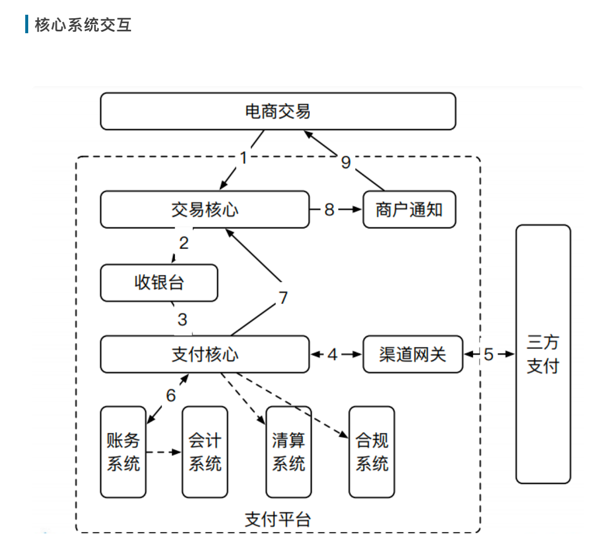
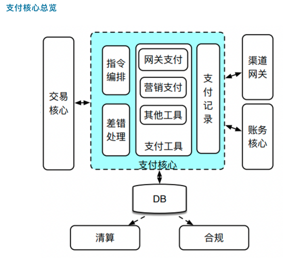
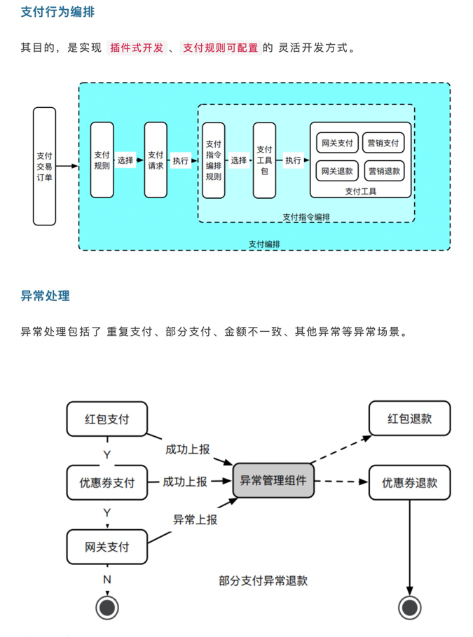
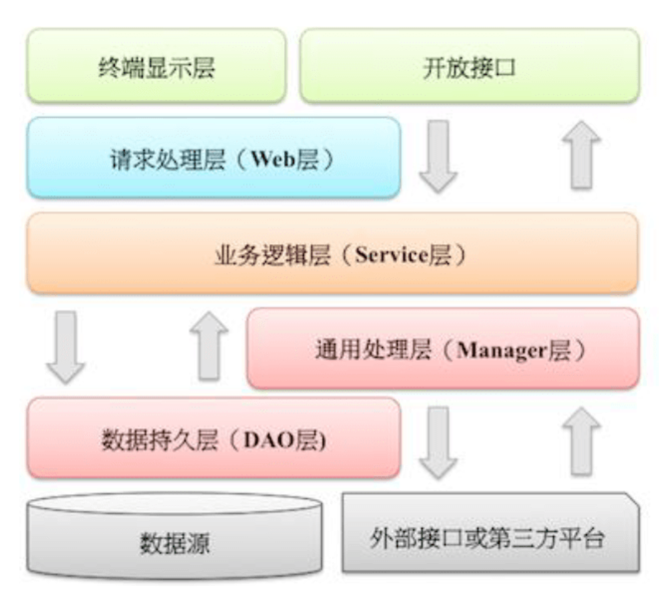

# paycore
支付核心项目

###项目介绍

1、项目简介
支付核心项目旨在帮助大家理解支付核心的整体设计，代码仅供参考

2、支付设计架构

**图片摘自公众号：Coder的技术之路**

整体核心架构

支付核心功能

###代码框架
SpringBoot、Dubbo、MySQL、Redis、MybatisPlus、XXL-JOB、RocketMQ等
后期会使用SpringCloudAlibaba改造

###代码分层结构定义，参考阿里巴巴开发手册

#####1、项目分层结构

#####2、模型分类

DO（ Data Object）：与数据库表结构一一对应，通过DAO层向上传输数据源对象。

DTO（ Data Transfer Object）：数据传输对象，RPC接口向外传输的对象。

BO（ Business Object）：业务对象。 由Service层输出的封装业务逻辑的对象。