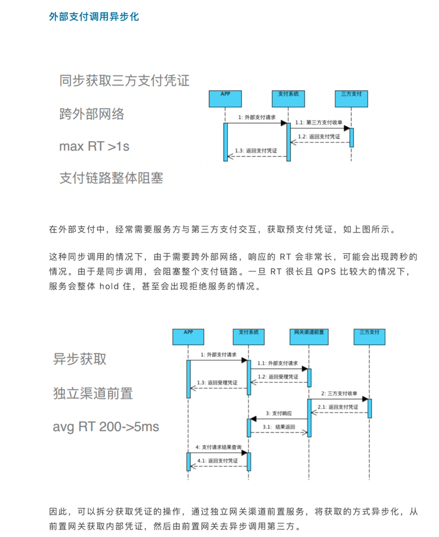
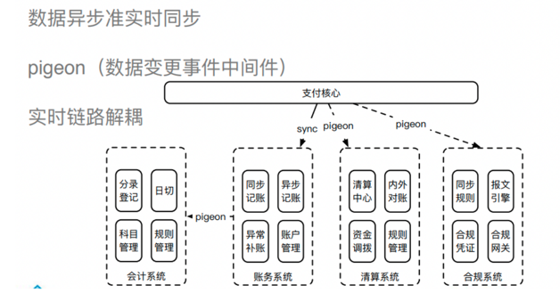

# paycore
支付核心项目

###项目介绍

1、项目简介
支付核心项目旨在帮助大家理解支付核心的整体设计，代码仅供参考

支付系统与清算系统应该是各自独立的，前者ᨀ供适应各类产品使用的基础支付服务；

后者则将所有机构所能ᨀ供的底层清算服务归集，专门负责与银行的各类清算接口对接；

支付层则对外ᨀ供各类经过包装的支付服务，其涵盖了清算服务、账务服务、客户相关服务等，实现对基础支付服务的编排。

为了简化系统的调用将清算系统整合在了支付核心系统之中，请特别注意这一点.

2、支付设计架构

**图片摘自公众号：【Coder的技术之路】**

微信文章地址：https://mp.weixin.qq.com/s/Fod2aAVfTOMaAt6IBWByYg

整体核心架构

定位是为集团内部各个业务线(电商业务、供应链业务、直播业务、打车等)提供统一支付能力.

整体支付链路和支付核心所处位置如下：

支付核心功能

包括：支付、退款、提现、充值、转账、代发、渠道小额代扣、线下打款等能力

（1）支付指令编排,对资金组装并排序，按照支付工具类型请求对应的资金渠道

（2）支付差错处理：包括支付场景的超时、状态不一致处理

支付核心设计核心点：

1、接口异步化、批量代替单笔

（1）渠道调用异步调用，可以先落单，然后按照渠道提供接口TPS 异步发起调用

（2）MQ消息解异步耦系统，包括账户与会计系统解耦,支付系统与结算、对账系统、计费系统解耦等

（3）如果渠道提供批量操作接口例如批量查询、批量扣款，对即时性要求不太高的场景，可以单笔转换为批量操作.

2、分布式事务问题

网上有很多分布式事务的框架像GTS、SEATA和方案像TCC、MQ消息事务,这些事务框架降低了分布式事务开发难度，但是
缺乏灵活性. ⼤型的⽀付公司，内部都有⾮常严格和完备的数据⼀致性⽅案，⽐如采⽤业务侵⼊性⾮常
⼤的分布式事务等，以牺牲开发效率来提升数据的稳定，是⾮常有必要的，如果不采⽤分布式事务⼜有哪些应对策略呢？

（1）CAS操作保证数据一致性

（2）资金入账出账两阶段模型： 出账成功后，后续阶段操作交由 异步任务执行.

例如提现业务，可以第一步冻结资金,第二步代发到银行卡，第二步成功，第三步解冻资金转账到待清算充值内部户,
也可以使用中间户,第一步转账到中间账户，第二步代发银行卡，第二步成功,中间户入账待清算充值内部户.
混合支付场景中,第一段 多资金源入账到中间户都成功后，第二段 中间户到 集团内部客户账户可以异步执行.

（3）差错处理
针对第二段入账差错问题，例如系统超时可以自动重试，如果例如客户状态异常 ，系统操作重试可能无法解决，只能手动操作重试
最终使用对账系统和数据稽核系统可以兜底保证数据一致性.

（4) 账务系统异步入账、缓冲记账等手段有效减少账务系统记账返回时间.
    

3、数据拆分

可以根据需求按照日期、客户账户进行分库分表拆分，框架可以使用 sharding-jdbc
地址：https://shardingsphere.apache.org/document/current/cn/overview/

项目中按照使用按照交易日期按照天维度拆分，没有使用sharding-jdbc分库分表框架，使用了更灵活的 Mybatis-Plus提供的动态表名框架

https://baomidou.com/pages/2a45ff/#dynamictablenameinnerinterceptor

###代码框架
SpringBoot、Dubbo、MySQL、Redis、MybatisPlus、XXL-JOB、RocketMQ等
后期会使用SpringCloudAlibaba改造

###代码分层结构定义，参考阿里巴巴开发手册

#####1、项目分层结构

#####2、模型分类

DO（ Data Object）：与数据库表结构一一对应，通过DAO层向上传输数据源对象。

DTO（ Data Transfer Object）：数据传输对象，RPC接口向外传输的对象。

BO（ Business Object）：业务对象。 由Service层输出的封装业务逻辑的对象。